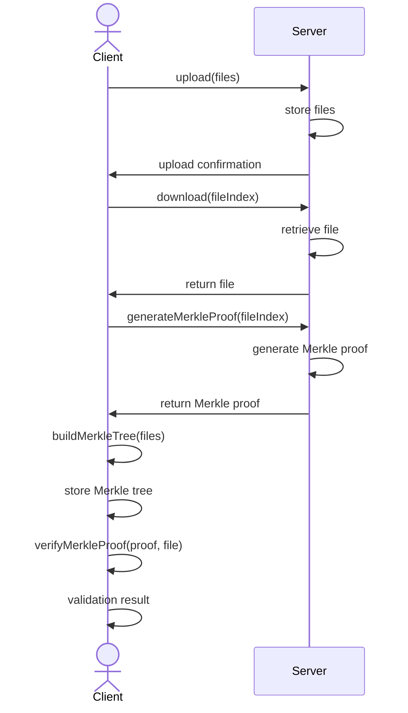

# rustle-tree

## Flow 

```mermaid
sequenceDiagram
    actor Client
    participant Server

    Client->>Server: upload(files)
    Server->>Server: store files
    Server->>Client: upload confirmation

    Client->>Server: download(fileIndex)
    Server->>Server: retrieve file
    Server->>Client: return file

    Client->>Server: generateMerkleProof(fileIndex)
    Server->>Server: generate Merkle proof
    Server->>Client: return Merkle proof

    Client->>Client: buildMerkleTree(files)
    Client->>Client: store Merkle tree

    Client->>Client: verifyMerkleProof(proof, file)
    Client->>Client: validation result

```
