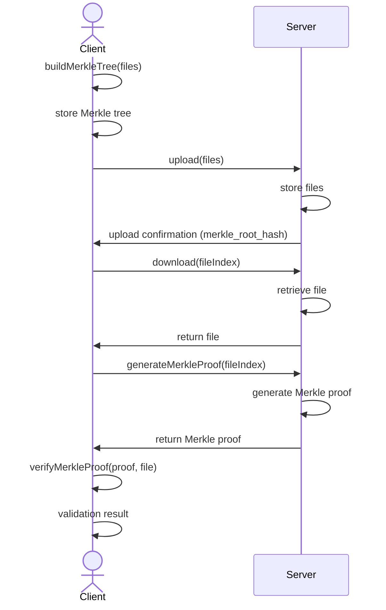

# rustle-tree

Rustle tree (Merkle trees in Rust) aims at providing a secure and efficient way to manage and verify file integrity using Merkle trees. It leverages segment trees for building Merkle trees, utilizes gRPC protocol for communication between clients and servers, and offers a CLI binary crate for easy client access. The project is designed to be deployable using Docker Compose, ensuring ease of deployment and scalability.

## Requirements

* Rust (v1.80.0 or higher)
* protoc compiler (v23.3 or higher)
* docker (v20.10.21 or higher)
* docker-compose (v20.20.2 or higher)
* VSCode or any other suitable IDE

## Overview and Structure

Refer [here](https://github.com/srinathLN7/rustle-tree/blob/main/OVERVIEW.md) for the challenge description and the project structure.


## Features

- **Merkle Tree Construction**: The project employs [segment trees](https://en.wikipedia.org/wiki/Segment_tree) for constructing Merkle trees efficiently. Merkle trees provide a cryptographic hash-based data structure that allows for efficient verification of large datasets. Building merkle trees from scratch and generating merkle proofs for a given file index forms the crux of the project. For more information about this refer [the merkle library crate](https://github.com/srinathln7/rustle-tree/tree/main/merkle/src). 

- **Protocol Buffers**: We define a Protocol Buffers (protobuf) file to specify the structure of messages exchanged between the client and server. Protocol Buffers offer a language-agnostic and efficient way to serialize structured data. Click [here](https://github.com/srinathln7/rustle-tree/tree/main/api_v1/src/proto) to learn more.

- **gRPC Communication**: gRPC is utilized as the underlying communication protocol between the client and server. This ensures efficient and secure communication between components. Click here to access more info about the [grpc server binary crate](https://github.com/srinathln7/rustle-tree/tree/main/api_v1/src) and [grpc client binary crate](https://github.com/srinathln7/rustle-tree/tree/main/api_v1/src/client)

- **CLI Application**: Merkle Guard provides a CLI application for clients to interact with the server. This CLI application offers commands for uploading files, downloading files, generating Merkle proofs, and verifying file integrity. See [here](https://github.com/srinathln7/rustle-tree/tree/main/cli/src) for more infomation about the `cli` binary crate.

- **Docker Compose Deployment**: The project includes Docker Compose configuration for easy deployment and scaling. Docker Compose allows for the deployment of the entire application stack with a single command, simplifying the deployment process.


## Flow



### Detailed Explanation

1. **Building Merkle Tree (Client-Side)**
   - **Client->>Client: buildMerkleTree(files)**
     Independently, the client builds a Merkle tree using the files it has. This process does not involve the server.
   - **Client->>Client: store Merkle tree**
     After building the Merkle tree, the client stores it locally for future use.

2. **Uploading Files**
   - **Client->>Server: upload(files)**
     The client sends a request to the server to upload a set of files.
   - **Server->>Server: store files**
     The server processes the files and stores them for future access.
   - **Server->>Client: upload confirmation**
     The server sends a confirmation back to the client indicating that the files have been successfully uploaded.

3. **Downloading Files**
   - **Client->>Server: download(fileIndex)**
     The client requests to download a file identified by `fileIndex`.
   - **Server->>Server: retrieve file**
     The server retrieves the requested file from its storage.
   - **Server->>Client: return file**
     The server sends the requested file back to the client.

4. **Generating Merkle Proofs**
   - **Client->>Server: generateMerkleProof(fileIndex)**
     The client requests the server to generate a Merkle proof for the file specified by `fileIndex`.
   - **Server->>Server: generate Merkle proof**
     The server generates the Merkle proof for the specified file.
   - **Server->>Client: return Merkle proof**
     The server sends the generated Merkle proof back to the client.

5. **Verifying Merkle Proofs (Client-Side)**
   - **Client->>Client: verifyMerkleProof(proof, file)**
     The client verifies Merkle proofs independently using its stored Merkle tree. This step involves checking the validity of the proofs against the local Merkle tree.
   - **Client->>Client: validation result**
     The client determines and outputs the result of the verification process, indicating whether the proof is valid or not.

### Key Points
- **Client Independence**: The client performs the tasks of building and verifying Merkle proofs independently of the server. This means that once the client has the necessary files and Merkle proofs, it can handle validation without any further interaction with the server.
- **Server Role**: The server is used solely for the tasks of uploading files, downloading files, and generating Merkle proofs. It does not participate in the client's internal processes for building or verifying the Merkle tree.

This setup allows the client to perform crucial validation steps offline or independently, ensuring that the client can manage proof verification autonomously after the initial interaction with the server.


## Usage

### Building the Application

To compile and build the application directly, use the following command:

```bash
cargo build --release
```

### Building with Docker

To build and run the application using Docker, execute:

```bash
docker compose up --build
```

## Testing

After the `target` directory has been successfully built, you can test the application by running the `cli` tool through the provided test scripts:

- To execute the tests directly on your local machine, run:

  ```bash
  ./test.sh
  ```

- Alternatively, you can run the tests within the Docker container by executing:

  ```bash
  docker exec -it rustle-cli sh
  ```

Please ensure that the `sample/upload` directory contains the necessary files in both scenarios.


## Improvements

To enhance the rustle-tree, the following improvements can be implemented:

* Implement Mutual TLS Authentication:
  - Introduce Mutual TLS-based authentication between the gRPC server and client to establish a secure and trusted communication channel. This ensures that both parties can verify each other's identities and encrypt the data exchanged during communication.

* Deployment Scripts for Cloud:
  - Develop deployment scripts to automate the process of deploying the gRPC server and client containers to the cloud platform such as AWS, Azure, GCP etc. This streamlines the deployment process and facilitates scalability and reliability.

* Database integration:
  -  Integrate a database into the gRPC server to persist file information, upload proofs, and other relevant data across server restarts. By leveraging a database, , the server can store and retrieve file metadata efficiently, ensuring data integrity and reliability. This enhancement allows the server to maintain stateful information, enabling seamless continuation of operations even after server restarts or failures. 

## License

This project is licensed under the [MIT License](LICENSE).
